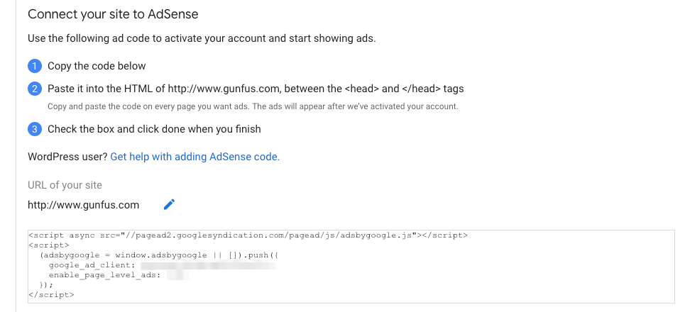

To add [Google AdSense](Google AdSense - Make Money Online through Website Monetization
https://www.google.com/adsense/start/) to a jekyll blog I found this post from [My Cyber Universe](https://mycyberuniverse.com/add-google-adsense-to-a-jekyll-website.html) was helpful but it lack of details, that I will provide here.

As you do this process *do* consider reading [13 Reasons Why Blog Ads Suck for Monetizing Your Site (And What to Do Instead](https://smartblogger.com/blog-ads/). And if you still want to do it, consider having a steady number of visits or google will consider you in violation of their policies and will revoke your adsense account. You can read the quality guidelines to help create better content for your blog. [AdSense quality guidelines](https://support.google.com/webmasters/topic/6001971?hl=en&ref_topic=6001981)

# So here are the neaty greaty details
1. Create the account with [Google AdSense](Google AdSense - Make Money Online through Website Monetization
https://www.google.com/adsense/start/) 
2. During the process there will be a *blur* about some script that needs to be added to the head
   
3. Copy the text from the *blur* in step 2
4. In your git repo, locate `_includes/head/custom.html` and paste the *blur* as prefered in that file
5. `git add`
6. `git commit -m "adding the blur"`
7. `git push`

